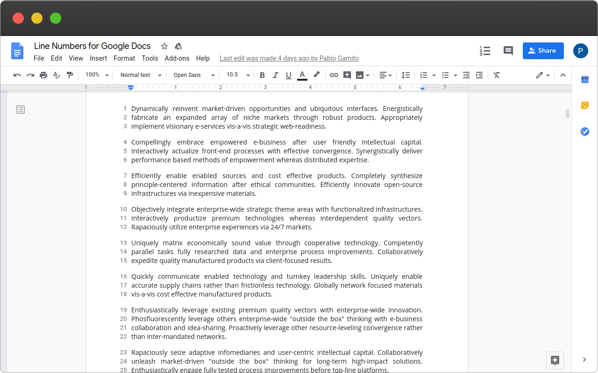
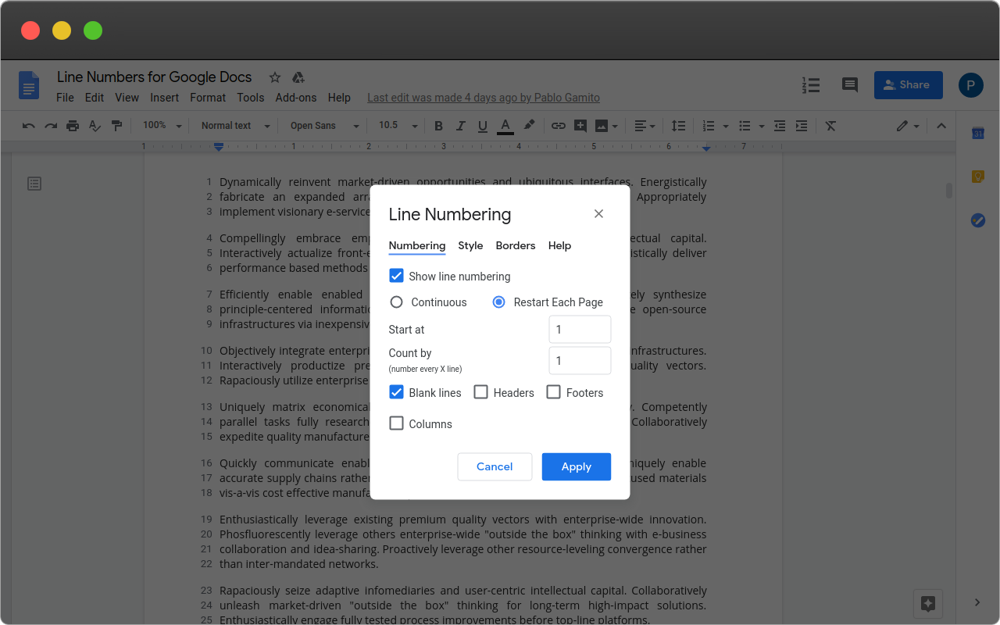

<!-- PROJECT SHIELDS -->
<!--
*** See the bottom of this document for the declaration of the reference variables
*** for contributors-url, forks-url, etc.
*** https://www.markdownguide.org/basic-syntax/#reference-style-links
-->
[![Contributors][contributors-shield]][contributors-url]
[![Forks][forks-shield]][forks-url]
[![Stargazers][stars-shield]][stars-url]
[![Issues][issues-shield]][issues-url]

<!-- PROJECT LOGO -->
 

  

  <h3 align="center">Line Numbers for Google Docs</h3>

  

    A seamless way to numbers the lines of your Google Docs!
     
    <a href="#download"><strong>Get it now »</strong></a>
     
     
    <a href="https://docs.linenumbers.app">Docs</a>
    ·
    <a href="https://github.com/Line-Numbers-for-Google-Docs/chrome-extension/issues">Report Bug</a>
    ·
    <a href="https://github.com/Line-Numbers-for-Google-Docs/chrome-extension/issues">Request Feature</a>
  

<!-- ABOUT THE PROJECT -->
## About The Project
> The simplest way to add line numbers to any Google Docs document

This lightweight extension allows you to add line numbers to any google docs document. The ability to number lines is the perfect way to print out a file with line numbers. Line numbering also makes it easy to work on long documents with others by simplifying the task of finding certain passages in a document.

## Download

Get it now on any of the supported browsers:
**[Chrome](https://chrome.google.com/webstore/detail/line-numbers-for-google-d/mblodabbcapnkgcfnddfpfaamjckjlik) · [Edge](https://microsoftedge.microsoft.com/addons/detail/llbpnbgpcgehofghbfkdmjjfjkfolgha)** 

<!-- ROADMAP -->
## Roadmap

See the [open issues](https://github.com/Line-Numbers-for-Google-Docs/chrome-extension/issues) for a list of proposed features (and known issues).

<!-- CONTRIBUTING -->
## Contributing

Contributions are what make the open source community such an amazing place to be learn, inspire, and create. Any contributions you make are **greatly appreciated**.

1. Fork the Project
2. Create your Feature Branch (`git checkout -b feature/AmazingFeature`)
3. Commit your Changes (`git commit -m 'Add some AmazingFeature'`)
4. Push to the Branch (`git push origin feature/AmazingFeature`)
5. Open a Pull Request

<!-- CONTACT -->
## Contact

Pablo Gamito - [pablo.gamito.me](https://pablogamito.com) - pablo@gamito.me

Project Link: [https://github.com/Line-Numbers-for-Google-Docs](https://github.com/Line-Numbers-for-Google-Docs)

<!-- MARKDOWN LINKS & IMAGES -->
<!-- https://www.markdownguide.org/basic-syntax/#reference-style-links -->
[contributors-shield]: https://img.shields.io/github/contributors/Line-Numbers-for-Google-Docs/chrome-extension.svg?style=flat-square
[contributors-url]: https://github.com/Line-Numbers-for-Google-Docs/chrome-extension/graphs/contributors
[forks-shield]: https://img.shields.io/github/forks/Line-Numbers-for-Google-Docs/chrome-extension.svg?style=flat-square
[forks-url]: https://github.com/Line-Numbers-for-Google-Docs/chrome-extension/network/members
[stars-shield]: https://img.shields.io/github/stars/Line-Numbers-for-Google-Docs/chrome-extension.svg?style=flat-square
[stars-url]: https://github.com/Line-Numbers-for-Google-Docs/chrome-extension/stargazers
[issues-shield]: https://img.shields.io/github/issues/Line-Numbers-for-Google-Docs/chrome-extension.svg?style=flat-square
[issues-url]: https://github.com/Line-Numbers-for-Google-Docs/chrome-extension/issues
